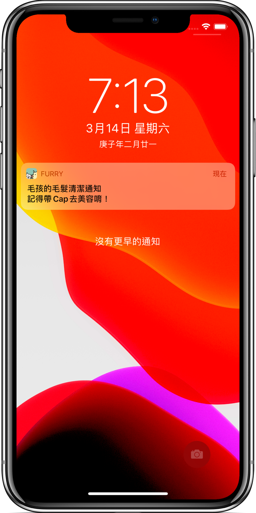

# Furry Diary  </a><a href="https://apps.apple.com/tw/app/furry-diary/id1500735959"></a>

Furry Diary是款協助你照料毛小孩的app，透過將各項紀錄上傳，細心維持毛孩良好的生活起居與身體健康狀態。
開啟提醒功能，不會漏掉任何需要處理的毛孩大小事。
還可以選擇朋友或家人成為```共同飼主```，雙方同步更新毛孩紀錄，一同照顧你們的毛小孩。

## Features & ScreenShots
### 建立毛孩日誌
+ 輸入毛孩詳細資訊
+ 可上傳```多張```毛孩漂亮照片
+ 在選擇共同飼主欄位的放大鏡時可以 ```搜尋其他使用者``` 

 </a>

### 我的毛孩
+ 顯示所有你有上傳的毛孩
+ 可```滑動```觀賞毛孩照片
+ 點選圖片可以看到毛孩詳細資料
+ 拖曳毛孩資訊列表有```縮放效果```
+ 點選編輯可更新毛孩資料

 </a>
 </a>
 </a>   

### 撰寫紀錄
+ 先點選要替哪隻毛孩紀錄已進入紀錄類別頁面
    
</a></a>

### 輸入頁面
+ 衛生清潔：包含毛孩自身清潔與生活起居，可開啟提醒功能
+ 預防計畫：包含疫苗及驅蟲紀錄，可開啟提醒功能
+ 體重紀錄：紀錄毛孩體重變化，可即時更新曲線圖以利追蹤
+ 行為症狀：紀錄毛孩的特殊反應與狀況，可於歷史頁面觀看及追蹤
+ 醫療紀錄：包含毛孩就診、手術及例行檢查，可開啟提醒功能
+ 用藥紀錄：包含毛孩內、外用藥紀錄，可開啟提醒功能

</a></a></a></a></a></a>

### 推播功能
+ 於紀錄時開啟提醒功能，可於指定日期提醒你毛孩的重要事項

</a></a>

### 歷史紀錄
+ 先點選要觀看哪隻毛孩的歷史紀錄
+ 使用月曆方式呈現，有紀錄事件的日期下方會有黃色點點
+ 點擊之後將顯示所有紀錄內容
    
</a>

### 附近獸醫院
+ 可自動定位使用者當前位置，並顯示附近獸醫院
+ 點選大頭針顯示獸醫院資料
+ 點選獸醫院視窗可進行```導航```

</a></a>


## Libraries

  + SwiftLint
  + Crashlytics
  + GoogleSignIn
  + GoogleAnalytics
  + Firebase Core
  + Kingfisher
  + IQKeyboardManagerSwift
  + FSCalendar
  + JGProgressHUD
  + PNChart
  
  
## Version History
    
  + 1.3    Oct 27, 2018
    + 改善使用者體驗
    + 修正錯誤
    
  + 1.1    Oct 24, 2018
    + UI 更新
    + 新增 App 內部評分
    + 關閉推播功能
    + 新增Apple Health功能

## Requirement
  + iOS 13.0+
  + Xcode 11.0

  
## Contacts
Savannah Su
tingchen0626@gmail.com

